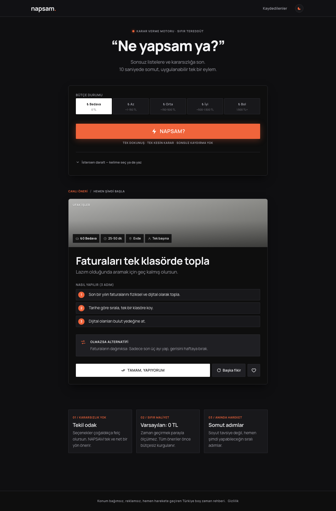
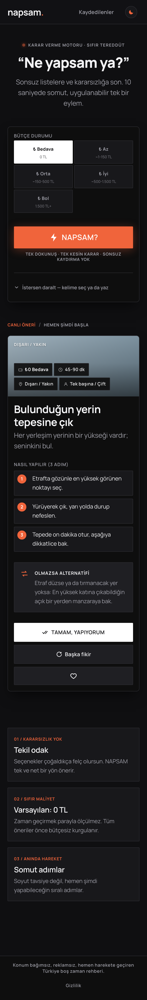
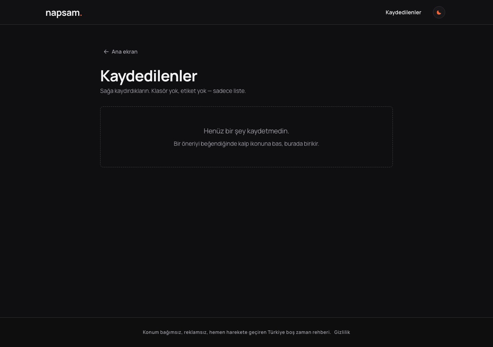
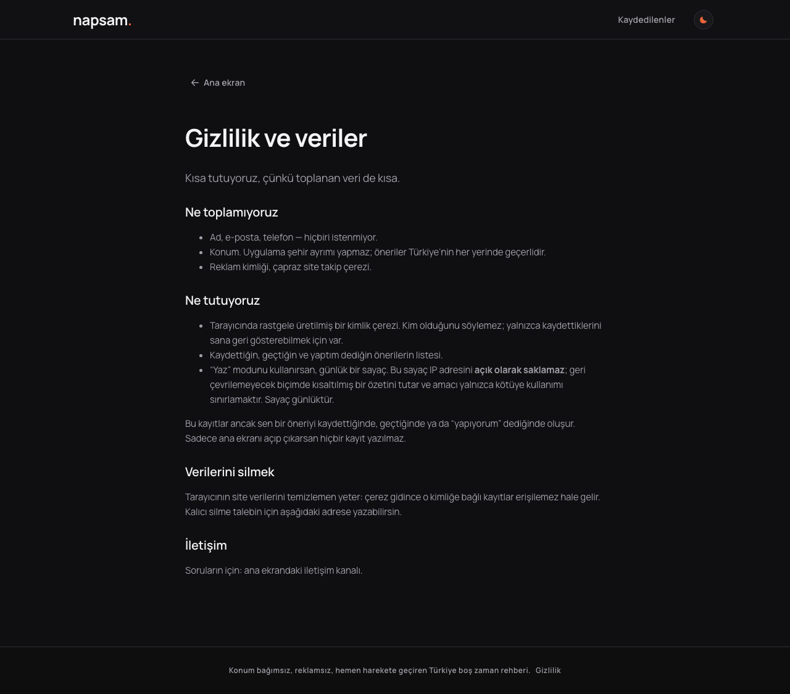
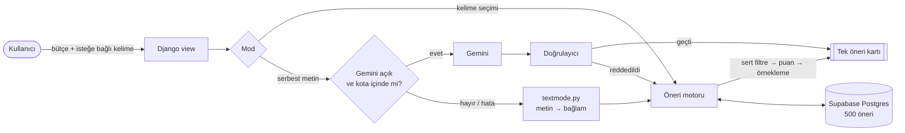

<div align="center">

# napsam.

### “Ne yapsam ya?” diyene tek dokunuşla tek bir somut fikir.

Bütçene uyan, **şu an ve bulunduğun yerde** yapabileceğin tek bir eylem.<br>
Sonsuz liste yok, kaydırma yok, kararsızlık yok.

[](https://napsam.vercel.app)


</div>

<p align="center">
  <a href="docs/screenshots/home-desktop.png"></a>
  &nbsp;
  <a href="docs/screenshots/home-mobile.png"></a>
</p>
<p align="center"><sub>Ana sayfa, baştan sona · masaüstü (1280 px) ve telefon (390 px) · büyütmek için görsele tıkla</sub></p>

---

## Fikir

Çoğu uygulama seni ekranda tutmak için tasarlanır. NAPSAM tam tersini hedefler:

> Uygulamayı açarsın, **10 saniyede** fikri alırsın, **uygulamayı kapatırsın** ve o şeyi yaparsın.

Bu üründe uzun oturum bir başarı değil, bir hatadır.

## Nasıl çalışır?

1. **Bütçeni seç:** Bedava · Az · Orta · İyi · Bol
2. İstersen **bir kelime seç ya da yaz** (kahve, dışarı, arkadaşımla…). Bu adım tamamen isteğe bağlı.
3. **NAPSAM?** butonuna bas. Karşına tek bir kart çıkar: ne yapacağın, 2-3 adımda nasıl yapacağın ve plan tutmazsa alternatifi.

Beğenmezsen **Başka fikir**, beğenirsen **Kaydet** ya da **Tamam, yapıyorum**.

### Diğer sayfalar

| Kaydedilenler | Gizlilik |
|---|---|
| <a href="docs/screenshots/saved-desktop.png"></a> | <a href="docs/screenshots/privacy-desktop.png"></a> |

## Öne çıkanlar

| | |
|---|---|
| 📍 **Konum bağımsız** | Her öneri Türkiye'nin her yerinde yapılabilir. Şehir, semt ya da işletme adı geçen öneri havuza giremez. |
| 💸 **Enflasyona dayanıklı bütçe** | Kademeler TL olarak değil, net asgari ücrete oranla saklanır. Asgari ücret değişince tek bir ayar güncellenir. |
| 🎯 **Seçimine sadık** | Seçtiğin kelime ve bütçe gerçekten uygulanır. Hiçbir şey eşleşmezse filtre kademeli gevşer, boş ekran görmezsin. |
| 🧠 **AI isteğe bağlı** | Gemini katmanı tek bir ortam değişkeniyle açılıp kapanır. Kapalıyken uygulama eksiksiz çalışır. |
| 🔒 **Gizlilik önce** | Üyelik yok, konum izni yok. Sadece gezinen ziyaretçi için veritabanına tek satır yazılmaz. |
| 📱 **Mobil uyumlu** | Açık/koyu tema, telefonda da taşmayan düzen. |

## Mimari



**Öneri motoru** (`core/engine.py`) üç adımda çalışır:

- **Sert filtreler:** bütçe tavanı ve bandı, günün saati ve gece güvenliği, hava, süre, kiminle, enerji, mekân, mevsim, seçilen kelime.
- **Yumuşak puanlama:** kalan adaylar bağlama göre sıralanır.
- **Çeşitlilik:** en iyilere yakın adaylar arasından, havuz büyüklüğüyle orantılı bir örneklemden rastgele seçim yapılır. Son görülen öneriler tekrar gelmez.

## Teknolojiler

| Katman | Seçim |
|---|---|
| Backend | Python 3.13, Django 5.2 |
| Veritabanı | Supabase Postgres (transaction pooler, psycopg 3) |
| Frontend | Sade HTML, CSS ve JavaScript. Framework ve build adımı yok. |
| AI (opsiyonel) | Google Gemini, günlük üç katmanlı kota ile |
| Yayın | Vercel (Django zero-config), statik dosyalar WhiteNoise ile |

## Proje yapısı

```
napsam/                 Django ayarları, URL'ler, WSGI
core/
  engine.py             öneri motoru: filtre, puan, örnekleme
  validators.py         içerik denetimi (konum, ton, biçim, yakın tekrar)
  ai.py                 Gemini katmanı ve kota koruması
  textmode.py           serbest metin → bağlam (AI olmadan da çalışır)
  chips.py              günün saatine göre değişen kelime seti
  middleware.py         çerez tabanlı anonim kimlik
  fixtures/
    suggestions.json    500 elle yazılmış, etiketli öneri
  management/commands/
    seed.py             içeriği denetleyip veritabanına yazar
  tests/                116 test
templates/              ana sayfa, kaydedilenler, gizlilik
static/                 css, js, favicon
```

## Yerelde çalıştırma

```bash
git clone https://github.com/kaaneneskpc/napsam.git
cd napsam

uv venv --python 3.13
uv pip install -r requirements.txt
cp .env.example .env

.venv/bin/python manage.py migrate
.venv/bin/python manage.py seed
.venv/bin/python manage.py runserver
```

`DATABASE_URL` boş bırakılırsa SQLite kullanılır. Hızlı geliştirme için bu yeterli.

### Ortam değişkenleri

| Değişken | Açıklama |
|---|---|
| `DJANGO_SECRET_KEY` | Üretimde zorunlu. Tanımsızsa uygulama açılmaz. |
| `DJANGO_DEBUG` | Yerelde `True`, üretimde `False` |
| `DATABASE_URL` | Supabase transaction pooler dizesi (port 6543) |
| `GEMINI_API_KEY` | Opsiyonel. Boşsa AI katmanı kapalı. |
| `GEMINI_MODEL` | Varsayılan `gemini-3.5-flash-lite` |

Gizli değerler yalnızca `.env` dosyasında ve Vercel ortam değişkenlerinde durur, repoya girmez.

## Test

```bash
.venv/bin/python manage.py test core
```

116 testin hiçbiri ağa çıkmaz, AI çağrıları taklit edilir. Testler içerik kurallarını da kilitler: havuzdaki bir öneri konum bağımsızlığı denetimini geçemezse test kırılır.

## İçerik

Öneriler `core/fixtures/suggestions.json` dosyasında durur. Bütçe dağılımı "önce bedava" ilkesine göre dengelenmiştir:

| Kademe | Aralık | Öneri |
|---|---|---|
| Bedava | 0 TL | 250 |
| Az | ~1-150 TL | 100 |
| Orta | ~150-500 TL | 75 |
| İyi | ~500-1.500 TL | 45 |
| Bol | 1.500 TL+ | 30 |

14 kategorinin her birinde 31 ile 42 arasında öneri var.

Yeni öneri eklerken önce denetleyip sonra yaz:

```bash
.venv/bin/python manage.py seed --check   # yazmaz, sadece denetler
.venv/bin/python manage.py seed
```

Her öneri şu kurallardan geçmek zorundadır:

- Başlık en fazla 6 kelime, emir kipinde
- Kanca tek cümle, adımlar 2 veya 3 madde
- "Olmazsa alternatifi" zorunlu
- Şehir, ilçe ya da işletme adı yok; koçvari dil yok
- Arkadaşla yapılabilen önerilerde "arkadaşımla" etiketi zorunlu
- Mevcut bir başlığa %72'den fazla benzeyen ya da ilk adımı birebir aynı olan öneri reddedilir

Kural ihlali olan hiçbir şey yazılmaz; komut hata verip çıkar.

<details>
<summary><b>Konum denetiminin Türkçe harf tuzağı</b></summary>

<br>

Denetim metni ASCII'ye katlayarak yapılır. Python'da `"İ".lower()` bir `i` ile birleşik nokta üretir, `"I".lower()` ise `ı` değil `i` verir. İkisi de basit bir blok listesini sessizce delerdi.

Tek kelimelik yasaklı terimler tam kelime olarak aranır, böylece bir semt adı başka bir kelimenin içinde geçtiği için yanlışlıkla eşleşmez.

</details>

## Yayın (Vercel + Supabase)

Vercel projesi bu repoya bağlı: **`main` dalına yapılan her push otomatik olarak production'a deploy edilir.** Vercel, Django'yu `manage.py` üzerinden algılar ve `collectstatic` komutunu kendisi çalıştırır.

Elle deploy gerekirse:

```bash
npx vercel@latest link --yes --project napsam
npx vercel@latest deploy --prod --yes
```

- **Seed işlemini session pooler (5432) ile çalıştır.** Uzun yazma işlemleri transaction pooler'da (6543) yarıda asılı kalabiliyor.
- Supabase `public` şemasındaki tüm tablolarda RLS açık ve policy yok; `anon` ve `authenticated` rollerinin yetkileri geri alındı. Veriye yalnızca Django erişir.

<details>
<summary><b>AI katmanını açma / kapama ve maliyet koruması</b></summary>

<br>

```bash
# Kapat: uygulama seed havuzuyla tam çalışmaya devam eder
npx vercel@latest env rm GEMINI_API_KEY production --yes

# Aç
printf '%s' "ANAHTAR" | npx vercel@latest env add GEMINI_API_KEY production
npx vercel@latest deploy --prod --yes
```

`/healthz/` ucundaki `aiEnabled` alanı o anki durumu gösterir.

API anahtarı proje sahibinin, çağrıyı yapan ise ziyaretçidir. Bu yüzden üç ayrı günlük tavan var ve en dar olanı geçerlidir:

| Kapsam | Varsayılan | Amaç |
|---|---|---|
| `global` | 200/gün | Kaç kişi kullanırsa kullansın maliyeti üstten kilitler |
| `ip` | 15/gün | Tek bir kaynağın tavanı tek başına tüketmesini zorlaştırır |
| `anon` | 5/gün | Normal kullanıcı için nazik sınır |

Tavanlar yönetim panelinden değiştirilebilir. IP, istemcinin uydurabileceği `X-Forwarded-For` ilk girdisinden değil, platformun kendi başlığından okunur.

En güçlü koruma Google tarafındadır: AI Studio'da faturalandırma kapalıysa kota bitince `429` döner ve ücret oluşmaz. Uygulama bu durumda sessizce seed havuzuna düşer.

</details>

## Bilinçli olarak yapılmayanlar

Bunlar eksik değil, karar:

- Onboarding, tanıtım slaytı, zorunlu üyelik
- Keşfet akışı ya da sonsuz kaydırma
- Streak, rozet, puan, günlük giriş ödülü
- Konum izni ve konum saklama

## Gizlilik

- Ana ekranı açıp çıkan ziyaretçi için veritabanına **tek satır bile yazılmaz**. Bu bir testle kilitlidir.
- Kayıt yalnızca kaydet, geç ya da yapıyorum eylemlerinde oluşur.
- Çerezde sadece rastgele bir UUID vardır, kim olduğunu söylemez.
- Konum hiçbir aşamada istenmez, gönderilmez, saklanmaz.

---

<div align="center">

**[napsam.vercel.app](https://napsam.vercel.app)** · [@kaaneneskpc](https://github.com/kaaneneskpc)

</div>
